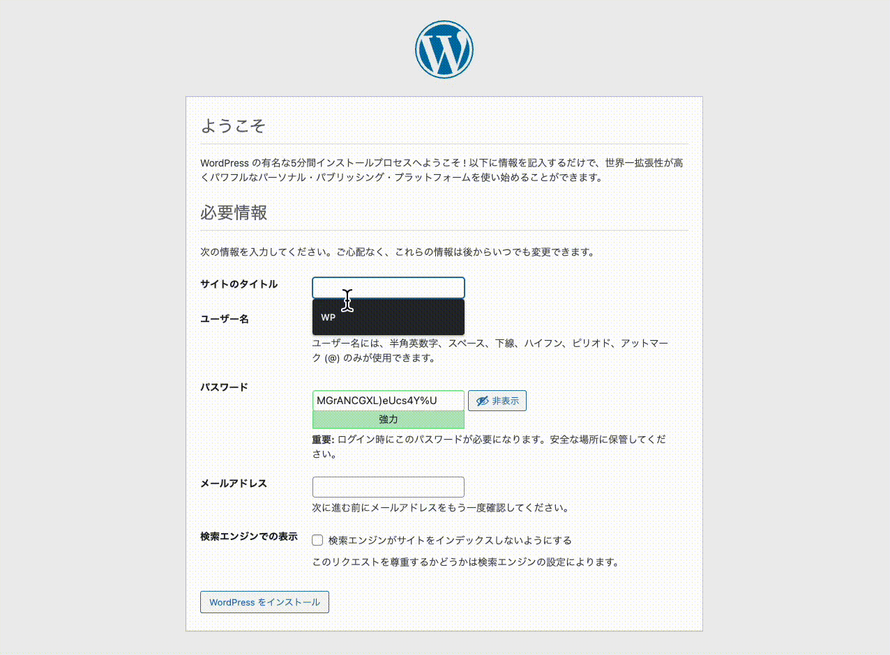
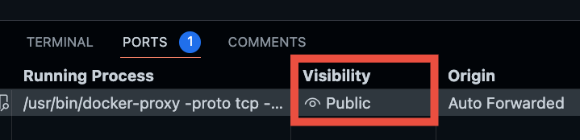
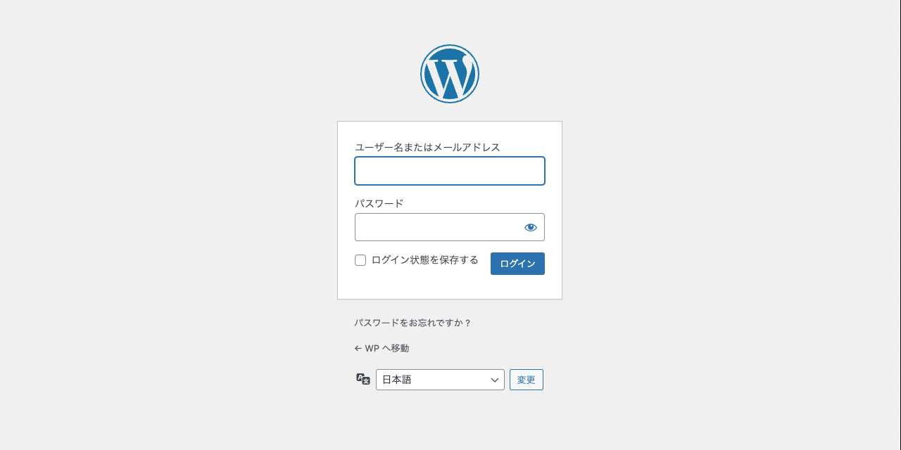

# WordPress サンドボックス

最新の WordPress を気軽に試すための Docker / Docker Compose 設定です。

## 動作確認時の環境

- Docker 24.0.2
- Docker Compose 2.18.1

## 内容物

- Apache 2.4
- PHP 8.1
- WordPress 日本語版 最新
- WP-CLI 最新

## 使い方

### 起動

```bash
# WordPress イメージをビルド
docker compose build

# MariaDB イメージのダウンロード
docker compose pull

# コンテナ起動
docker compose up -d
```

コンテナを起動すると `localhost` のポート `80` で WordPress が起動するのでブラウザまたはターミナルでインストール操作を行います。

ブラウザからインストールする場合のイメージ:



ターミナルからインストールする場合のイメージ:

```bash
WP_URL="http://localhost"
WP_ADMIN_USER="admin"
WP_ADMIN_EMAIL="example@example.com"
WP_ADMIN_PASSWORD="password"

docker compose exec wordpress \
  wp --allow-root core install \
  --url="$WP_URL" \
  --title="WordPress サンドボックス" \
  --admin_user="$WP_ADMIN_USER" \
  --admin_email="$WP_ADMIN_EMAIL" \
  --admin_password="$WP_ADMIN_PASSWORD" \
  --skip-email
```

#### GitHub Codespaces を使う場合

GitHub Codespaces でプレビューを利用する場合は、 URL が `localhost` ではないので、ブラウザではなくターミナルからインストールを行う方がスムーズです。

イメージ:

```bash
WP_URL="https://${CODESPACE_NAME}-80.githubpreview.dev"
WP_ADMIN_USER="admin"
WP_ADMIN_EMAIL="example@example.com"
WP_ADMIN_PASSWORD="password"

docker compose exec wordpress \
  wp --allow-root core install \
  --url="$WP_URL" \
  --title="WordPress サンドボックス" \
  --admin_user="$WP_ADMIN_USER" \
  --admin_email="$WP_ADMIN_EMAIL" \
  --admin_password="$WP_ADMIN_PASSWORD" \
  --skip-email
```

`wp` は `wordpress` イメージにインストールされた WP-CLI です。

このコマンドはリポジトリ内の `codespaces/install-wordpress-on-docker.sh` に記述してあるので、上のコマンドの代わりにこのスクリプトを実行しても OK です。

```bash
./codespaces/install-wordpress-on-docker.sh
```

コンテナ起動直後に実行すると、 MySQL が起動しきっておらずデータベース接続エラーが起こることがあります。
その場合は少し（数秒）待ってから再度コマンドを実行します。

ポートの公開設定（ Visibility ）が private だとブラウザでアクセスしたときに CSS などが正しく読み込まれないので、ポートの公開設定を public に変更します。



管理画面にログインできます。



### 停止

触り終わったらコンテナを停止します。

```bash
docker compose down
```

### MariaDB ボリュームの削除

```bash
docker volume rm wordpress-sandbox-ja_db_data
```

### WP-CLI

コンテナに WP-CLI がインストールされています。

```bash
docker compose exec wordpress wp
```

## 関連情報

かんたんな説明記事を書きました。

- [GitHub Codespaces で WordPress を動かす方法
 | gotohayato.com](https://gotohayato.com/content/543/)
